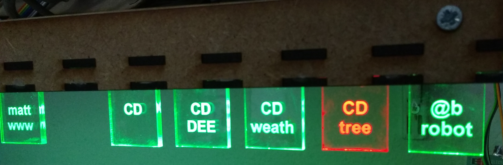
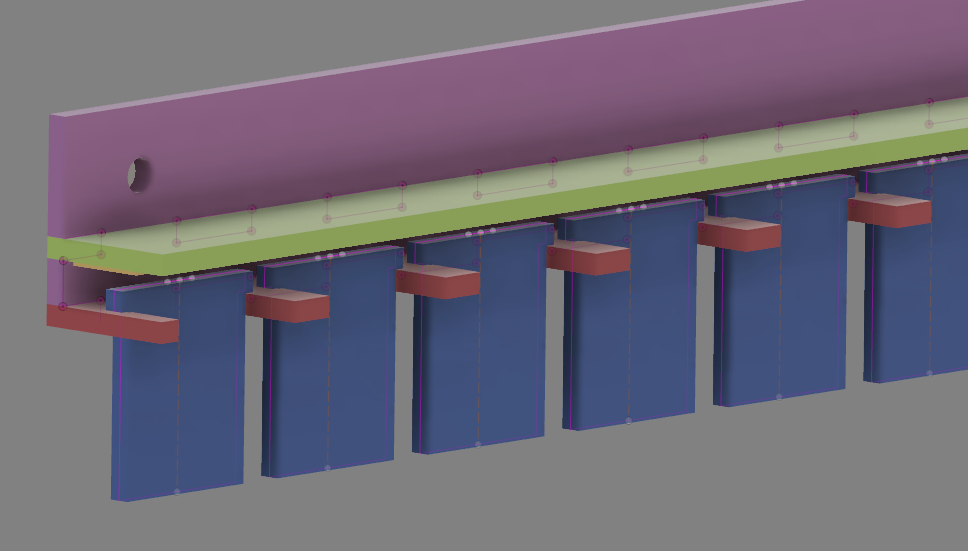

# uptime robot status strip

shows the status of all my online services

## CAD

[parametric fusion360 model](http://a360.co/2qQkqOp)

## uptime robot api 

[excellent api documentation](https://uptimerobot.com/api)

tested with:

    curl -X POST -H "Content-Type: application/x-www-form-urlencoded" -H "Cache-Control: no-cache" -d 'api_key=enterYourAPIKeyHere&format=json&logs=1' "https://api.uptimerobot.com/v2/getMonitors"

    curl -K curl.config 

used netcat to run a local server to grab the headers, and then used those
headers in the ESP8266 firmware.

## firmware

[PlatformIO, Arduino Framework targetting ESP8266](firmware)

library dependancies:

* [JsonStreamingParser](https://github.com/squix78/json-streaming-parser.git) - latest version providing reset required
* [adafruit library for HL1606](https://github.com/adafruit/HL1606-LED-Strip.git)

